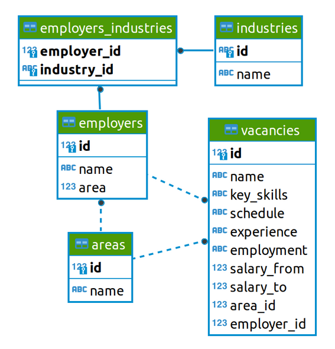

# Знакомство с данными

Таблицы находятся в схеме public базы данных project_sql.

## vacancies

Таблица хранит в себе данные по вакансиям и содержит следующие столбцы:

Зарплатная вилка — это верхняя и нижняя граница оплаты труда в рублях (зарплаты в других валютах уже переведены в рубли). Соискателям она показывает, в каком диапазоне компания готова платить сотруднику на этой должности.

## areas

Таблица-справочник, которая хранит код города и его название.

## employers

Таблица-справочник со списком работодателей.

## industries

Таблица-справочник вариантов сфер деятельности работодателей.

## employers_industries

Дополнительная таблица, которая существует для организации связи между работодателями и сферами их деятельности.

Эта таблица нужна нам, поскольку у одного работодателя может быть несколько сфер деятельности (или работодатели могут вовсе не указать их). Для удобства анализа необходимо хранить запись по каждой сфере каждого работодателя в отдельной строке таблицы.

